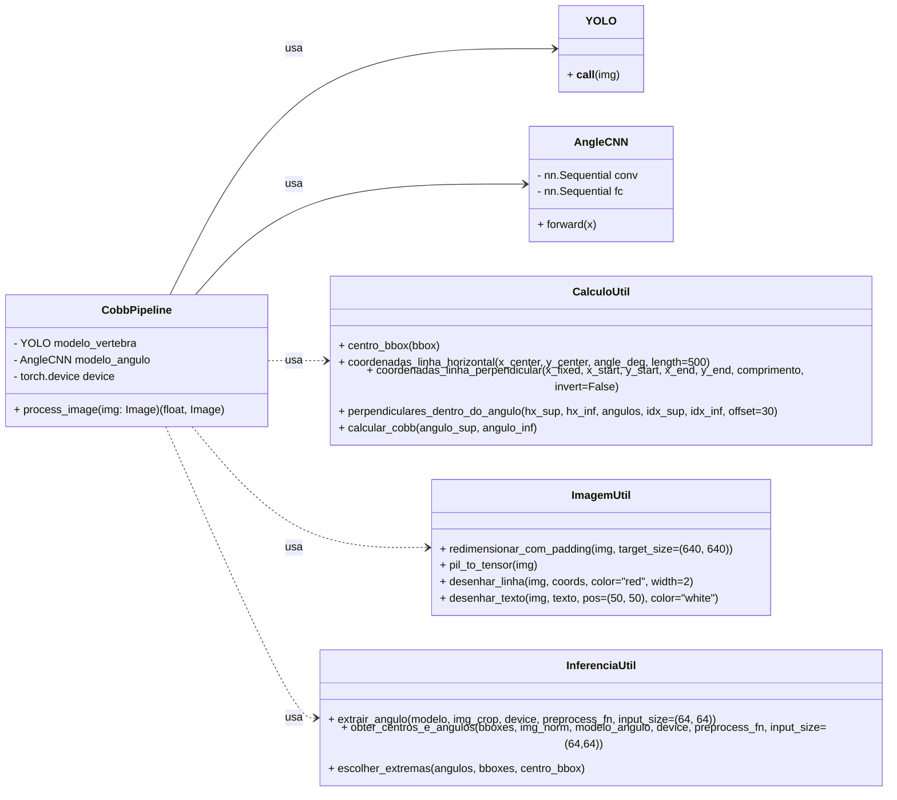
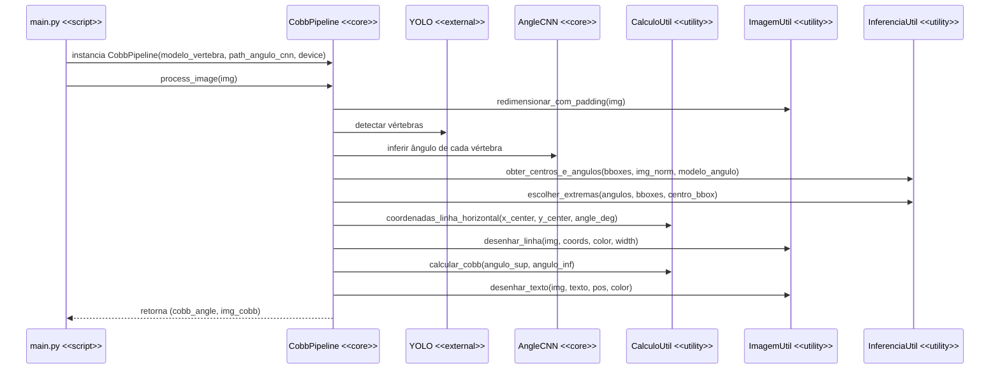

# Cobb API 🩻

API para processar imagens de raio-X e calcular o ângulo de Cobb.  
Retorna o valor do ângulo e a imagem processada em Base64.

## Diagrama de Classes



---

## Diagrama de Sequência



---

## 🚀 Requisitos

- Python 3.10+
- pip

---

## ⚙️ Configuração do ambiente

1. **Clonar o repositório**

```bash
git clone https://github.com/iasmin-boaventura/tcc-cobb/
cd cobb
````

2. **Criar e ativar o virtual environment**

```powershell
python -m venv venv
.\venv\Scripts\Activate.ps1
```

3. **Instalar as dependências**

```powershell
pip install -r requirements.txt
```

---

## 🏃 Rodando o servidor FastAPI

```powershell
uvicorn main:app --reload
```

* O servidor estará disponível em: `http://127.0.0.1:8000`
* Documentação interativa: `http://127.0.0.1:8000/docs`

---

## 📤 Testando a API com `curl`

Supondo que você tenha uma imagem `teste9.jpg` na pasta do projeto:

```powershell
curl -X POST "http://127.0.0.1:8000/process_image/" `
  -F "file=@teste9.jpg" `
  --output resposta.json
```

* O comando envia a imagem para a API e salva a resposta em `resposta.json`.
* Estrutura do JSON retornado:

```json
{
  "cobb_angle": 32.5,
  "image_base64": "iVBORw0KGgoAAAANSUhEUgAA..."
}
```

---

## ⚡ Usando no React

Exemplo simples de upload de imagem e exibição do resultado:

```javascript
const formData = new FormData();
formData.append("file", fileInput.files[0]);

const response = await fetch("http://127.0.0.1:8000/process_image/", {
  method: "POST",
  body: formData
});

const data = await response.json();

console.log("Cobb Angle:", data.cobb_angle);
document.getElementById("imagem").src = `data:image/png;base64,${data.image_base64}`;
```

```html

```

---

## ⚠️ Observações

* A API processa imagens em **grayscale** (tons de cinza).
* Certifique-se de enviar arquivos `.jpg` ou `.png`.
* Ideal para uso local ou integração com frontend React/JS.
